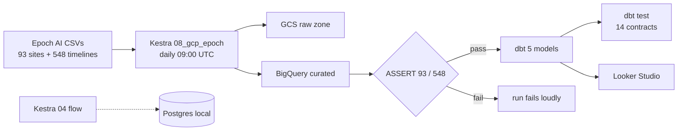

# Epoch AI Data Center Analytics – APAC Delivery Focus

Dashboard: https://datastudio.google.com/reporting/6192c6dc-90c3-45ae-990a-458f665d5557
Author: Ward (BINUS, AWS PM Intern APAC Data Center Delivery target)

## Problem
Where is AI capacity growing, how fast to build, where next in APAC? US dominates at ~12GW, APAC only 4 countries tracked. Delivery must choose Johor vs Batam.

## Source (not mine)
Epoch AI – AI Data Centers (CC-BY): https://epoch.ai/data/ai-data-centers
- `data_centers.csv` (93 sites), `data_center_timelines.csv` (548 rows, Oct 2026 snapshot)
- Accessed Oct 2026. Analysis mine.

## Architecture (batch, daily 09:00 UTC)
Kestra is the workflow orchestrator here (the Airflow equivalent in the course): it schedules the daily run, retries failed downloads, and versions the whole pipeline as YAML.
- Local path: Kestra `04_postgres_epoch` → Postgres `epoch` (tables data_centers_raw, data_center_timelines_raw). Zero cloud cost, good for trying the cleaning logic.
- GCP path: Kestra `08_gcp_epoch` → raw CSVs to GCS `gs://epoch-ai-data-lake-ward/raw/` → curated tables to BigQuery `epoch-ai-data-center.epoch_ai_dataset` (data_centers CLUSTER BY country,owner with no partitioning because a 93-row dimension gains nothing from it; timelines PARTITION BY date plus clustering because every mart filters by date) → row count ASSERTs (93 / 548, the run fails loudly on drift).
- Model: dbt (stg + mart_country_power + mart_yearly_power + mart_owner_power + mart_build_velocity, all covered by tests in `models/schema.yml`) → Looker

## Dashboard (2 required + 2 bonus)
1. Total Power by Country – AI Data Centers (bar, categorical)
2. Average Days from Groundbreaking to Full Power – AI Data Centers (line, temporal)
3. APAC Focus table + memo (Malaysia 895 MW, Indonesia 72 MW)
4. Map (bonus)

## How to run
Prereqs: Terraform + gcloud auth, Docker, a Kestra server, dbt with the BigQuery adapter (`pip install dbt-bigquery`).

1. Provision: `terraform init && terraform apply` in the repo root (bucket + dataset, US).
2. Values: in Kestra open Namespaces → zoomcamp → KV Store and add `GCP_PROJECT_ID` (value `epoch-ai-data-center`) and `GCP_SERVICE_ACCOUNT` (paste the full service account JSON, never commit it). Both are read via `kv()` because namespace Secrets need Enterprise Edition. Flow 08 also takes `bucket`/`dataset` inputs (defaults match step 1).
3. Import `flows/04_postgres_epoch.yaml` (local path) and `flows/08_gcp_epoch.yaml` (GCP path) into Kestra, then Execute. Flow 08 uploads raw CSVs to GCS, loads curated newline-delimited JSON to BigQuery (immune to stray quotes and embedded newlines in source text), and ASSERTs row counts 93 / 548. A failed ASSERT means source drift, fix the column mapping before trusting the dashboard.
4. Local Postgres path: `docker compose up -d`, then run flow 04 (inputs default to host localhost, db epoch, user epoch).
5. dbt: copy `epoch_analytics/profiles.example.yml` into your dbt profiles as `epoch_analytics`, set `GOOGLE_APPLICATION_CREDENTIALS`, then `dbt run` (expect 5/5) and `dbt test` in `epoch_analytics`.
6. Open the Looker link.

## Quality gates
- `dbt test`: unique + not_null contracts on staging and every mart (see `models/schema.yml`). Source freshness is enforced in orchestration instead of dbt because the CSVs carry no ingest timestamp.
- Row count ASSERTs inside flow 08 catch source drift at load time and fail the run.
- CI (`.github/workflows/ci.yml`): Terraform fmt + validate and Kestra YAML syntax on every push.
- No committed state, keys, or build output (see `.gitignore`).

## Latest verified run (Oct 2026)
- Kestra flow 08: success end to end, BigQuery counts 93 and 548 match the ASSERTs.
- dbt run: PASS 5 of 5. dbt test: PASS 14 of 14.
- CI: green on every push (see Actions tab).

## Known limitations
- Pinned snapshot: row counts, power figures, and the memo describe Oct 2026. Epoch updates will trip the ASSERTs first, then the numbers need rebasing.
- Small data: 93 sites fit in memory. The transferable part is the practice (tests, monitoring, IaC), not the volume.
- The 04 Postgres path is a local dev alternative. CI covers Terraform and YAML only; dbt needs a live warehouse, so run `make dbt-test` before trusting changes.
- `force_destroy = true` is demo only. Never use it on a bucket you care about.
- data_centers is clustered but deliberately unpartitioned: partitioning a 93-row dimension adds cost without benefit.

## My decision (memo)
Malaysia leads APAC (Johor). Recommend Johor expansion + Batam next. Avg build 900 days (2024) vs 3000 (2019) – delivery faster now. Risk: grid + water.
